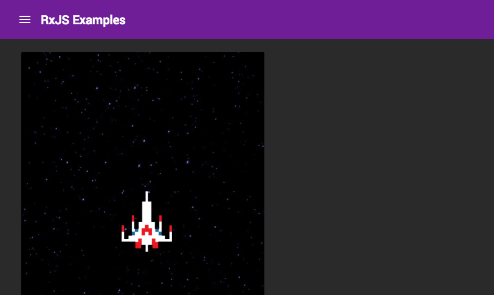

# RxJS Quickstart Examples

<p align="center"></p>

## Prerequisites

* You will need to have NodeJS and NPM installed from [nodejs.org](https://nodejs.org)

## Getting Started

```
git clone https://github.com/briebug/rxjs-quickstart.git
cd rxjs-quickstart
npm i
npm start
```
